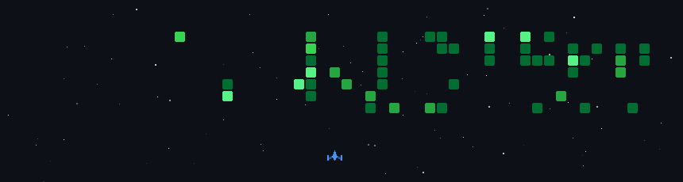

<h2 align="center">Hi, I'm Radesh</h2>

  

<table width="100%">
<tr>

<td width="60%" valign="middle">

<b>About Me</b>

I build things that live on the internet, break them, fix them and occasionally make them look good too.
I'm mostly working with React, Node.js, Three.js, and whatever catches my interest that week.
Currently learning, building, and figuring things out as I go.

</td>

<td width="40%" align="center" valign="middle">
 

 
 

 
 

</td>

</tr>
</table>

 

<table width="100%">
<tr>

<td width="50%" align="center" valign="top">

<b>Tech Stack</b>

</td>

<td width="50%" align="center" valign="top">

<b>Activity Graph</b>

</td>

</tr>
</table>

 

<table width="100%">
<tr>

<td align="center">

<b>Contribution Streak</b>

</td>

</tr>
</table>

 

  

<i>high on caffine ~</i>

